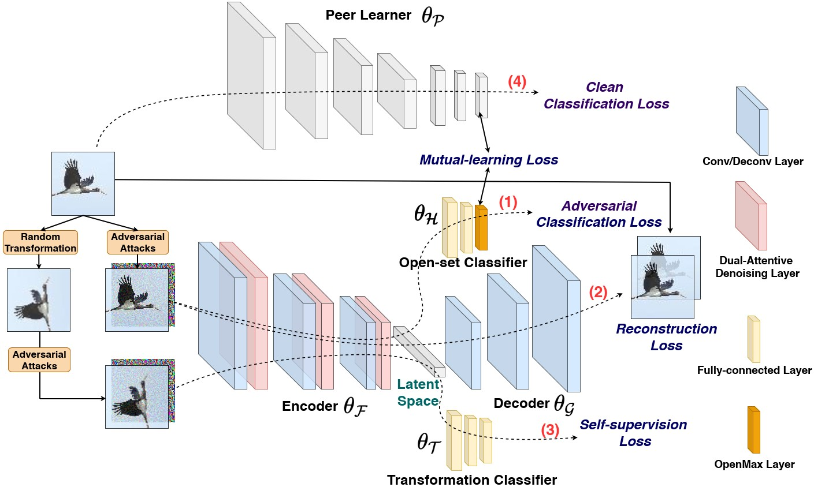

# IJCV2022-OSDN-CAML
Pytorch codes for Open-set Adversarial Defense with Clean-Adversarial Mutual Learning <a href=https://arxiv.org/pdf/2202.05953.pdf> (pdf) </a> in IJCV 2022.


As extension of Open-set Adversarial Defense <a href=https://www.ecva.net/papers/eccv_2020/papers_ECCV/papers/123620664.pdf> (pdf) </a> in ECCV 2020, this paper proposes an Open-Set Defense Network with Clean-Adversarial Mutual Learning (OSDN-CAML) as a solution to the OSAD problem. The proposed network designs an encoder with dual-attentive feature-denoising layers coupled with a classifier to learn a noise-free latent feature representation. A decoder is incorporated to ensure that clean images can be well reconstructed from the obtained latent features. Then, self-supervision is used to ensure that the latent features are informative enough to carry out an auxiliary task. Finally, to exploit more complementary knowledge from clean image classification to facilitate feature denoising and search for a more generalized local minimum for open-set recognition, we further propose clean-adversarial mutual learning, where a peer network (classifying clean images) is further introduced to mutually learn with the classifier (classifying adversarial images).

Network structure of OSDN-CAML consists of five components: encoder, decoder, open-set classifier, transformation classifier and peer learner.



# Setup

* Prerequisites: Python3.6, pytorch=1.2, Numpy, libmr

* The source code folders:

  1. "models": Contains the network architectures of proposed OSDN-CAML. 
  2. "advertorch": Contains adversarial attacks such as FGSM and PGD. Thanks the codes from: https://github.com/BorealisAI/advertorch
  3. "OpensetMethods": Contains the open-max function. Thanks the codes from: https://github.com/lwneal/counterfactual-open-set
  4. "datasets": Contains datasets
  5. "misc": Contains initialization and some preprocessing functions
  
# Training

To run the train file: python train.py

# Testing

To run the test file: python test.py

It will generate .txt file that contains the score for close-set accuracy and AUROC.

# Acknowledge
Please kindly cite this paper in your publications if it helps your research:
```
@article{shao2022open,
  title={Open-set Adversarial Defense with Clean-Adversarial Mutual Learning},
  author={Shao, Rui and Perera, Pramuditha and Yuen, Pong C and Patel, Vishal M},
  journal={International Journal of Computer Vision},
  pages={1--18},
  year={2022},
  publisher={Springer}
}
```

Contact: rshaojimmy@gmail.com
